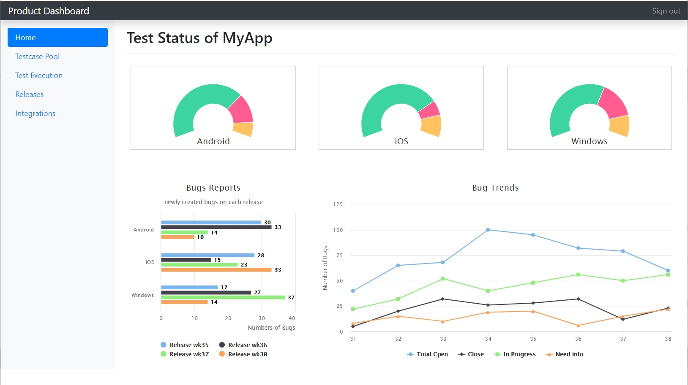

# Dashboard
Test manager dashboard
This dashborad shall be use by test manager to see the progress report of current ongoing projects.

# Requirement
To run this dashbaord. you must have python and django installed on your pc

# Run 
got to the dashboard folder and run below command  
  
$ python manage.py runserver  
  
above command will start a local server  

open your browser and go to url http://127.0.0.1:8000/dashapp/

